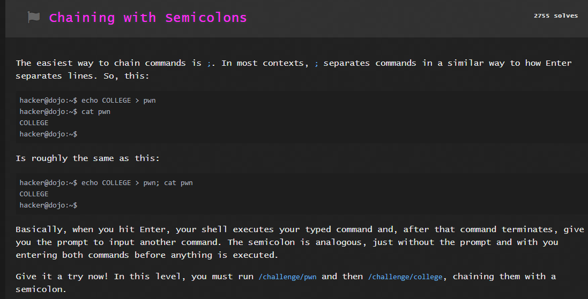
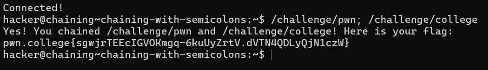
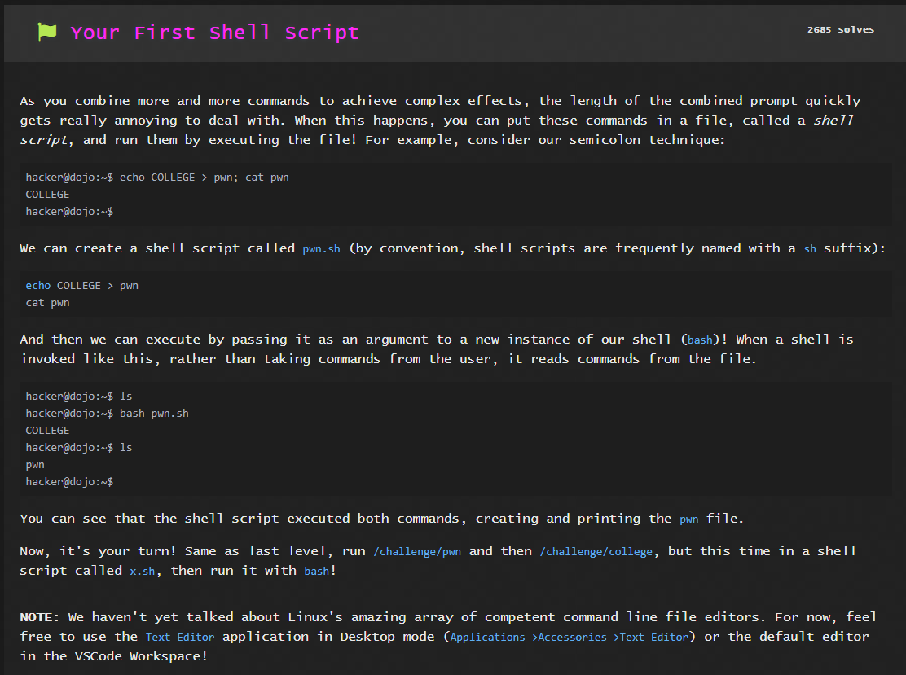
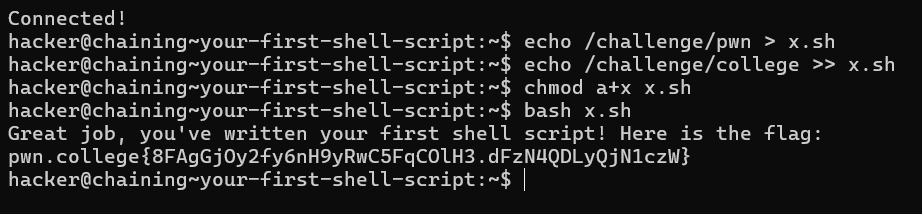
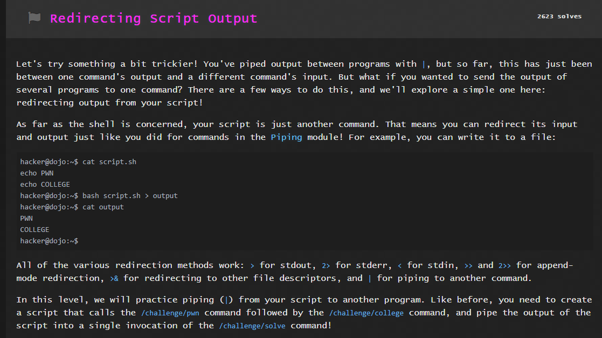
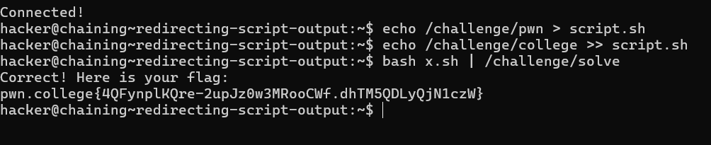
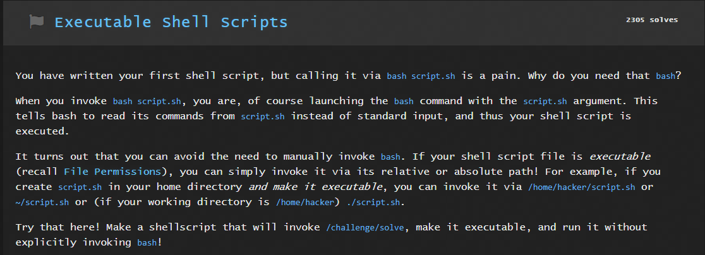
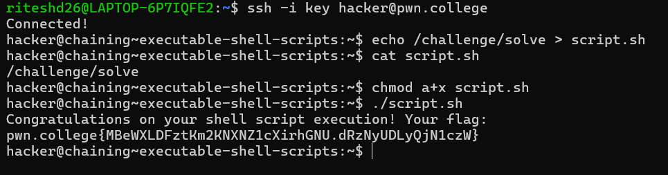

# LINUX LUMINARIUM
## Chaining Commands

### Question 1

Solution:

### Question 2

Solution:

From the practicing piping module , I got to know that the `>` operator is used to write/overwrite a file and the `>>` operator is used to append instructions in a file.
This allowed me to store `/challenge/pwn` and `/challenge/college` in line 1 and line 2 of `x.sh` respectively.

`chmod a+x x.sh`

I used this cmd to allow all to execute the file x.sh

### Question 3

Solution:

The first two cmds are similar as the previous problem, the only difference is the output of `bash x.sh` is being piped out to `/challenge/solve`.

### Question 4

Solution:

1st cmd write `challenge/solve` in the first line of `script.sh`.

`cat script.sh` is done to confirm the line of the code that is to be executed.

`chmod a+x script.sh` allows all to execute the file.

As mentioned in the question, `./script.sh` would give the same result as `bash script.sh`.

