## Pondering Paths
### Question 1
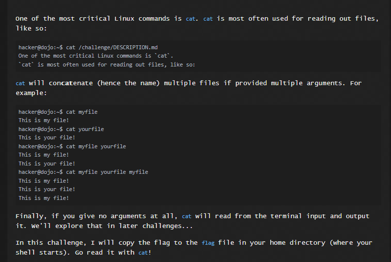
Solution:
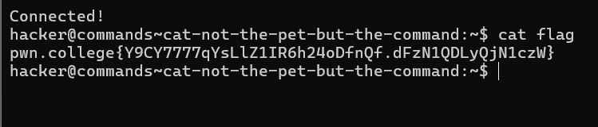

### Question 2
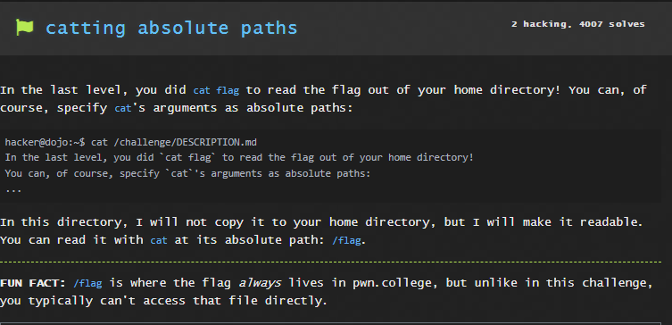
Solution:
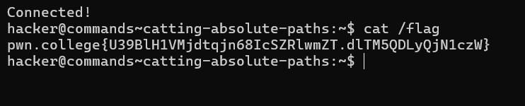

### Question 3
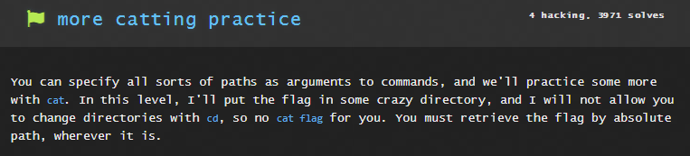
Solution:
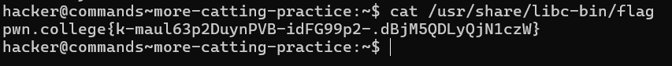

### Question 4
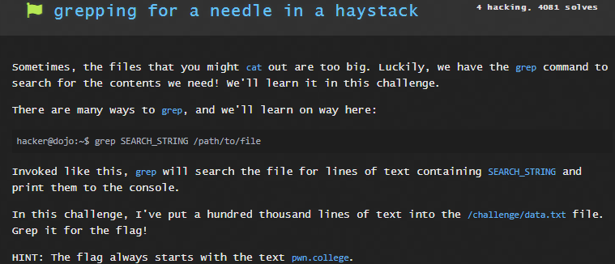
Solution:
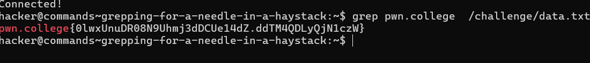

### Question 5
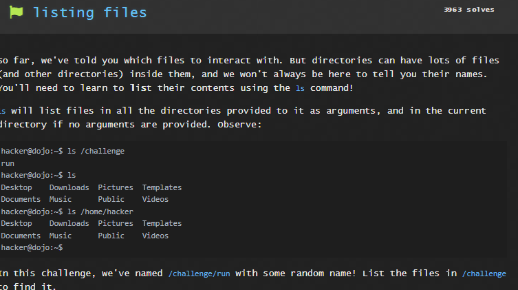
Solution:
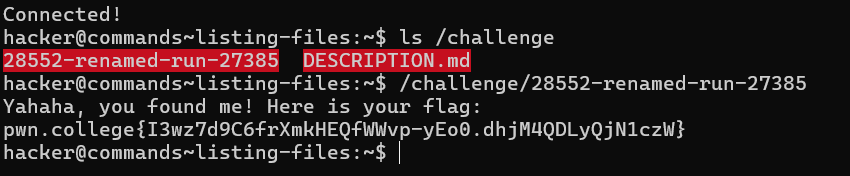

### Question 6
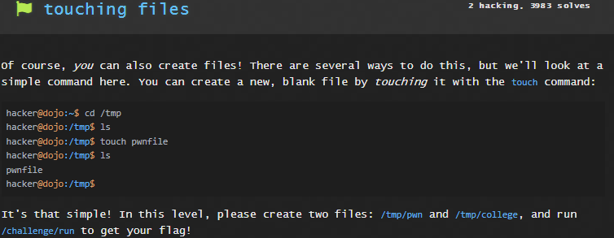
Solution:
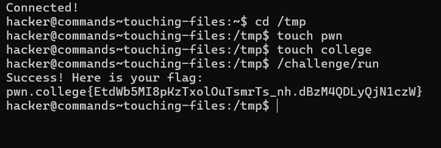

### Question 7
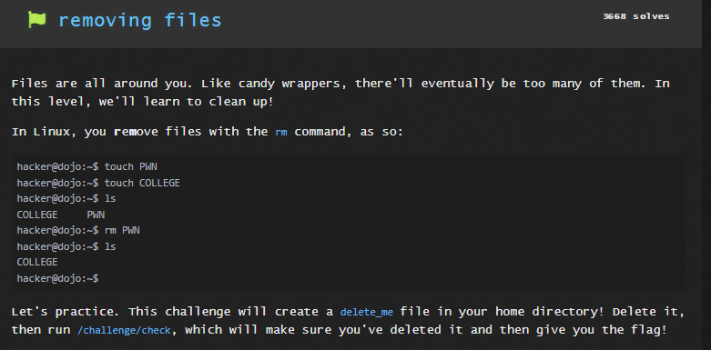
Solution:
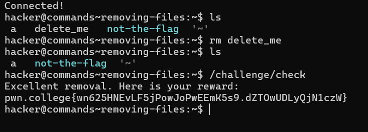

### Question 8
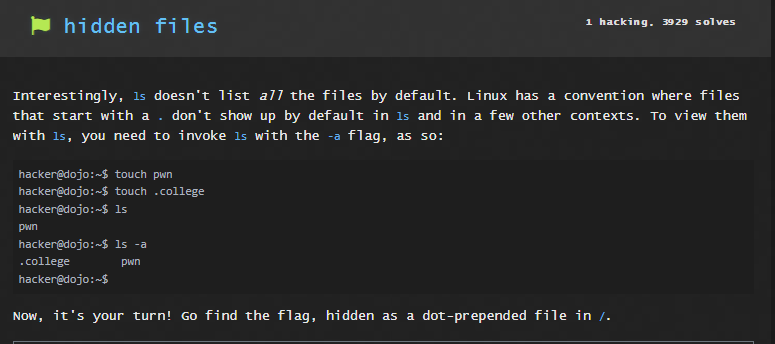
Solution:
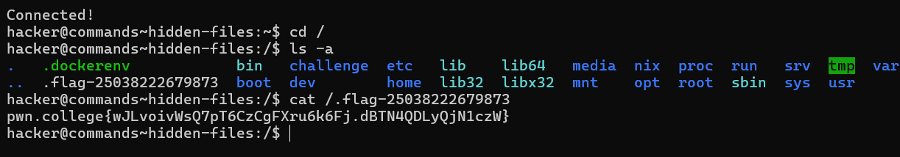

### Question 9
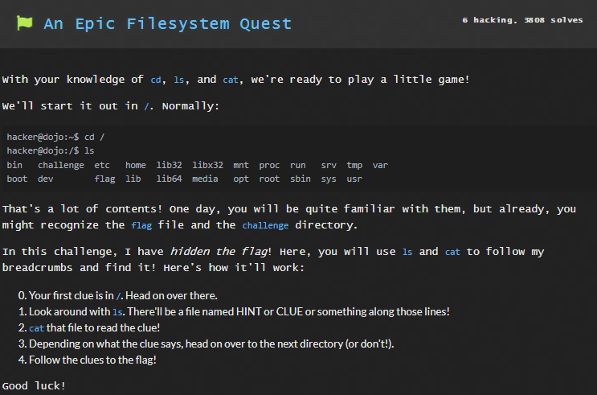
Solution:

### Question 10
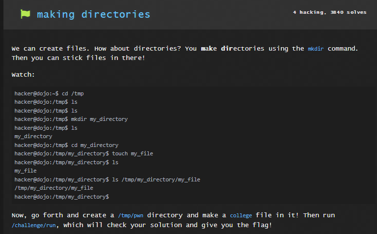
Solution:
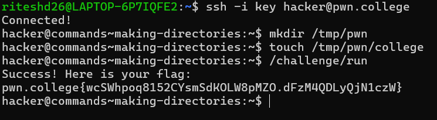

### Question 11
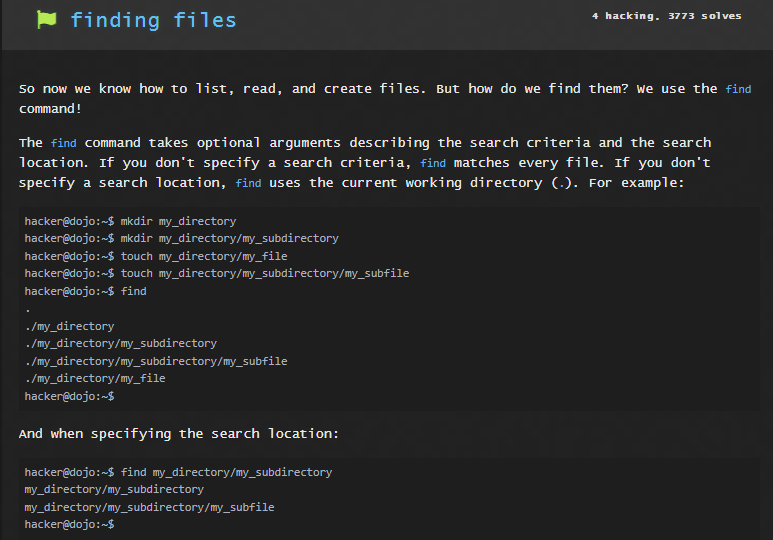
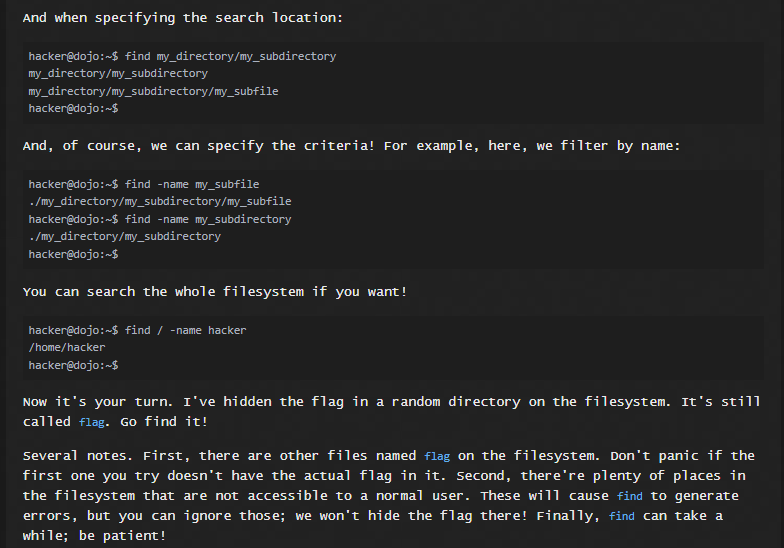
Solution:

### Question 12
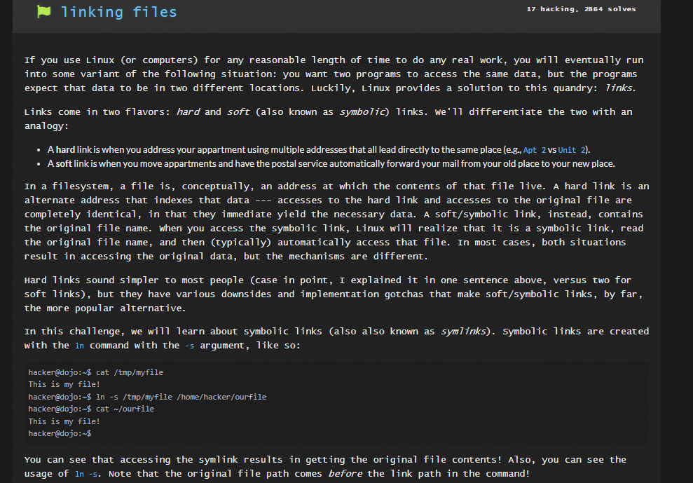
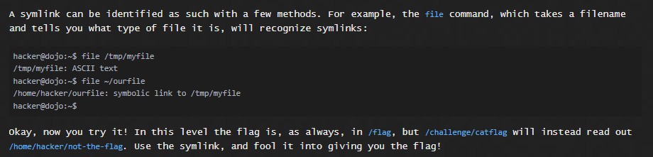
Solution:
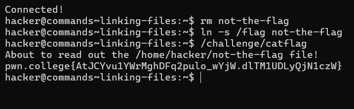

