# DIGESTING DOCUMENTATION
## QUESTION 1
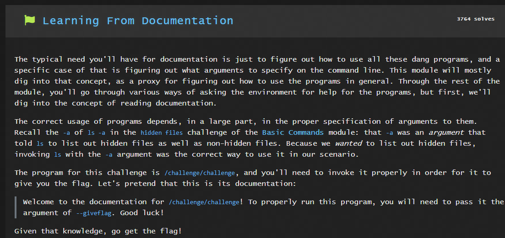
Solution:

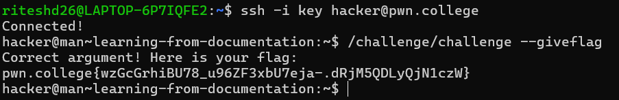

## QUESTION 2
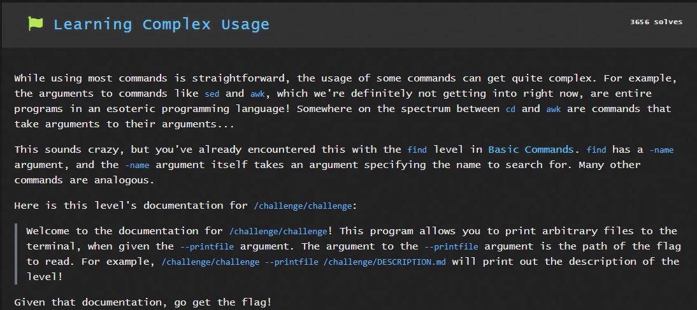
Solution:

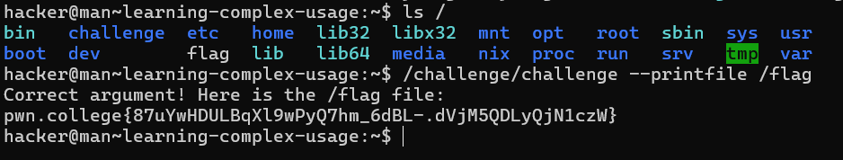

## QUESTION 3
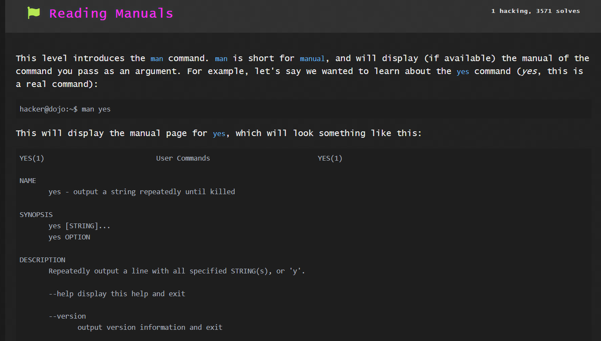
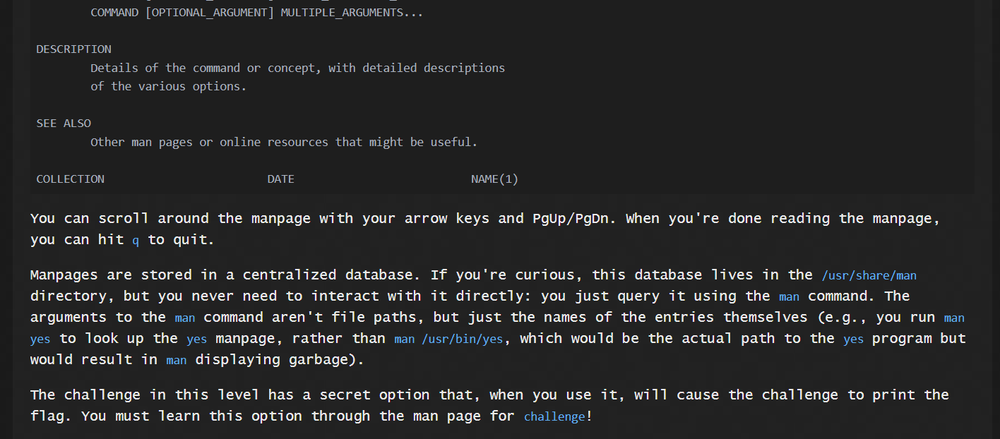
Solution:

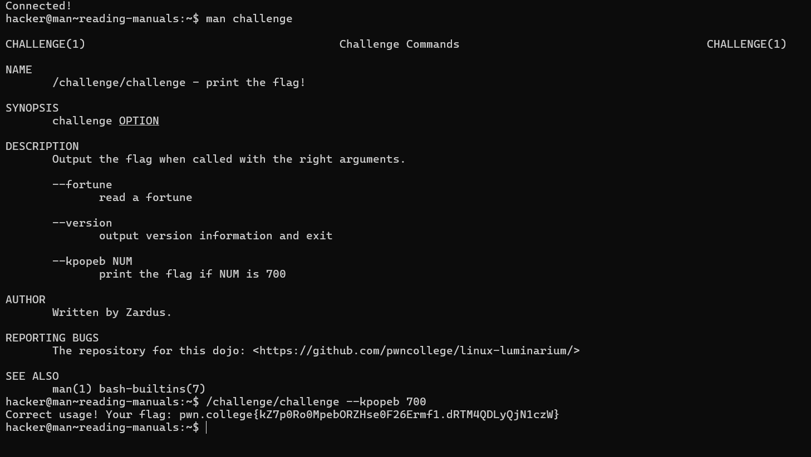

## QUESTION 4
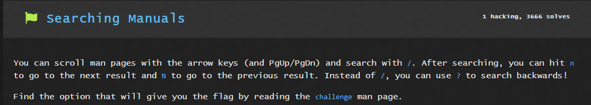
Solution:
`man challenge`

This gave me a list a arguements. I searched for the flag by:

`?flag`

and to traverse through different lines containing the word flag I used N.
This gave the arguement that would fetch me the flag
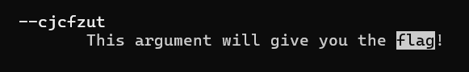

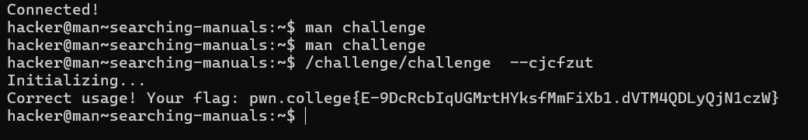

## QUESTION 5
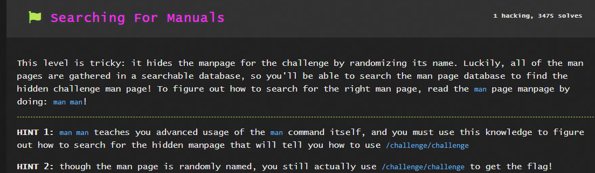
Solution:

`man man`

This fetched me various commands that could fetch me details about the flag.

`man -k challenge`

This was one of the commands I found from the list that fetched:

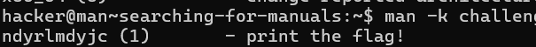

Finally, by following the instructions

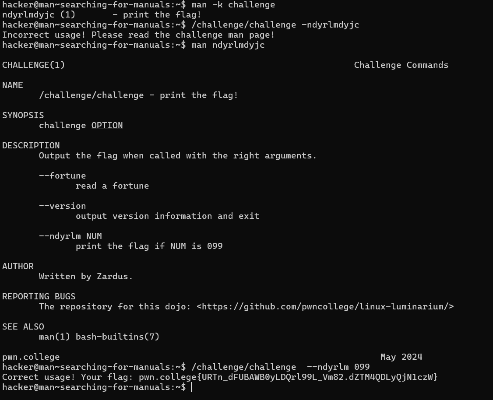
## QUESTION 6
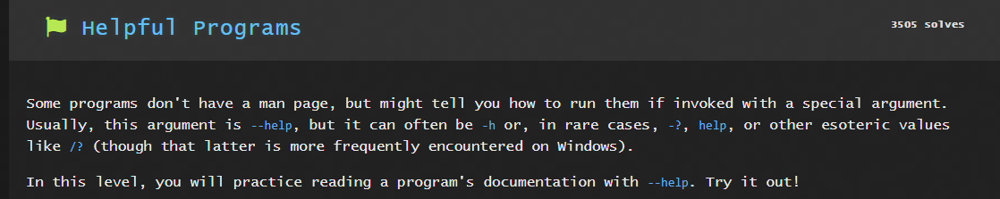
Solution:

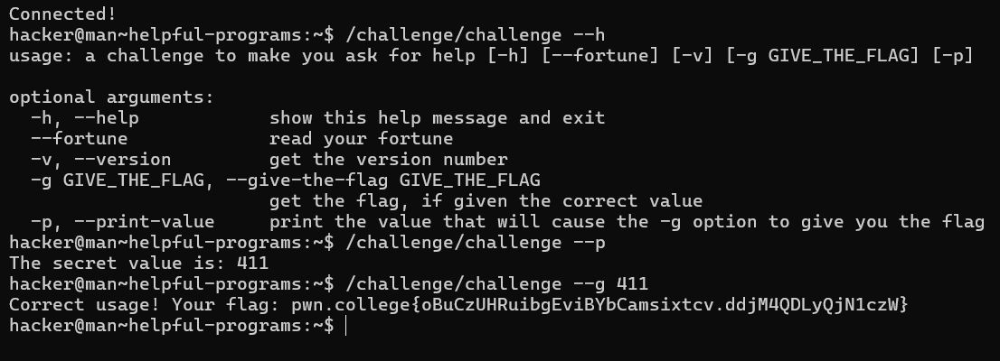

## QUESTION 7
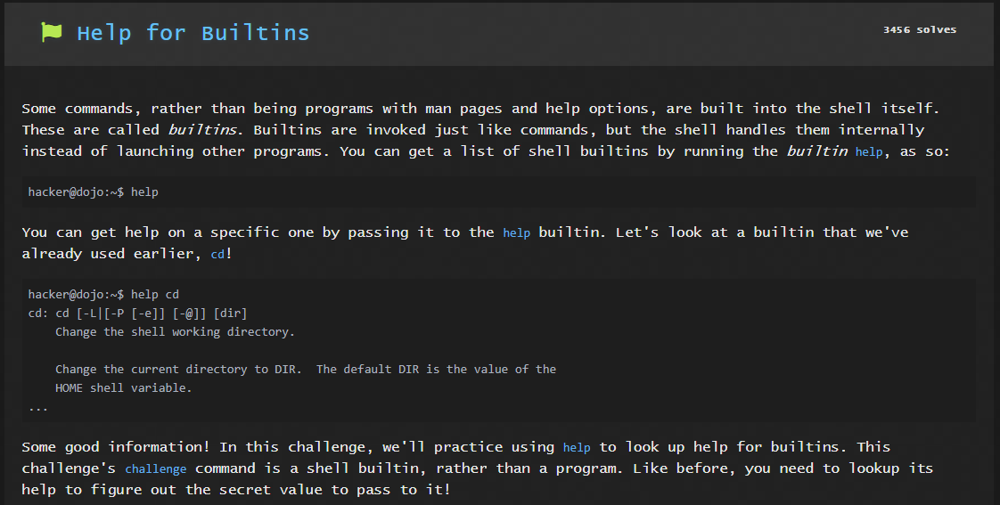
Solution:

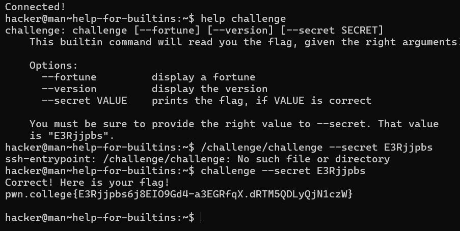