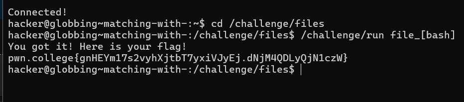

# LINUX LUMINARIUM
## File Globbing

### Question 1

Solution:

* syntax is used write file names in short.
For example challenge could be written as ch*.(If there are no ther files starting with ch*)

### Question 2

Solution:

? syntax can be quite helpful to find the files which contain specific alphabets that we know. But it is necessary to know the length of the file name.

### Question 3

Solution:

[] is syntax that lists out all the files whose name start with the alphabets written in it.

### Question 4

Solution:

Same as the previous problem, the only difference is, the path of the file is mentioned here.

### Question 5

Solution:

`/challenge/files$ challenge/run [cep]*`

This lists down all the files having filenames starting from c , e and p.

### Question 6

Solution:

This is similar to problem 5, all the files not starting with p,w and n are displayed.

