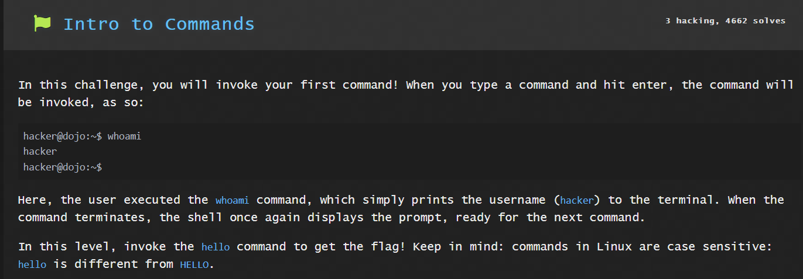
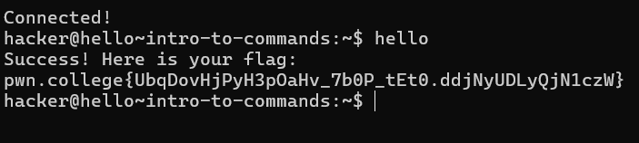
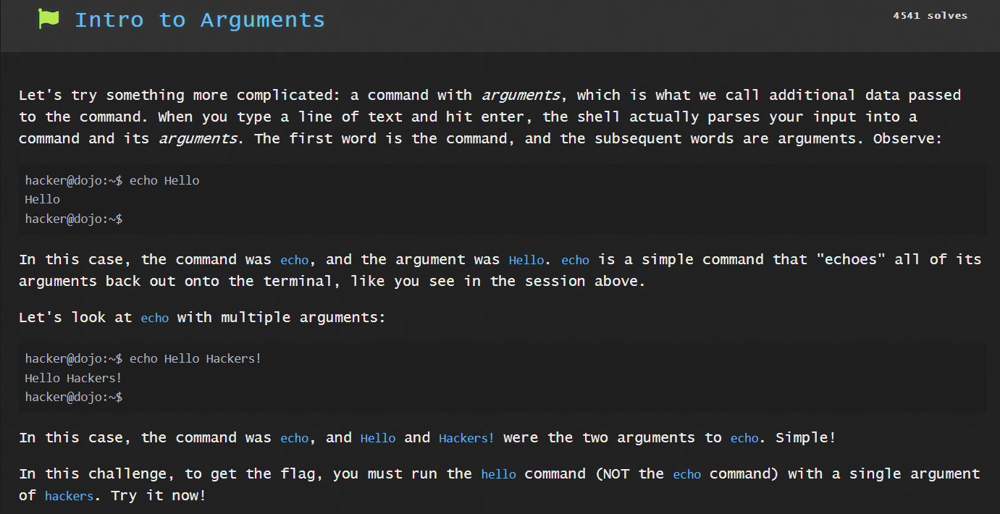
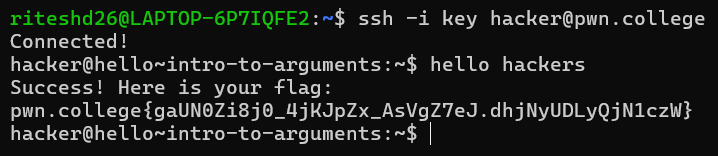

# Linux Luminarium
## Hello Hackers
### Question 1

Solution:

`hello`

This gives the flag for the next question.

### Question 2

Solution:       
### command: 
`hello hackers`

This will get you the flag.

