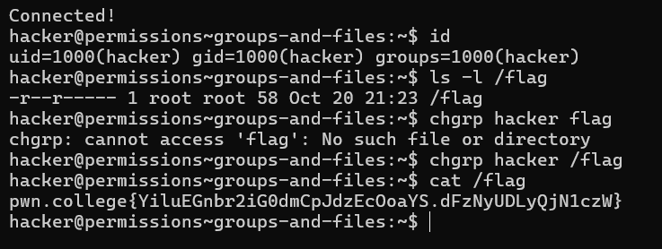
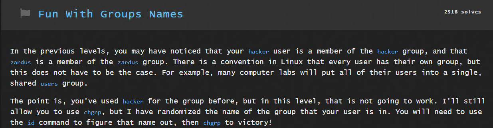
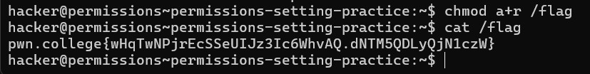

# Linux Luminarium
## Perceiving Permissions

### Question 1

Solution:

### Question 2

Solution:
`chgrp hacker flag`

this helped me to change the current user from root to hacker after which i was able to read the file.

### Question 3

Solution:

For this problem, I ran through all the usernames hand the username grp12013 worked and enabled me to cat the /flag.

### Question 4

Solution:

`chmod o+r /flag`

The above command helped me to make it readable for all the users without changinh the current user who owned the file.

### Question 5

Solution:

`chmod u+x /flag`

The above command helped me to make the file /flag executable for the current user who is the owner of the file. This helped me execute the cmd /challenge/run and I was able to read the flag.

### Question 6

Solution:

After solving the 8 rounds continuously and correctly , the owner of the file /flag is changed. 
So, I changed the the permissions of the file as read all in order to read the flag.

### Question 7

Solution:

After rigorously setting different permissions for /challenge/pwn , I make the /flag file readable and get  the flag.

### Question 8

Solution:

I allowed to user to execute the file but with SUID permission. This was the only task here that let me read the flag.

