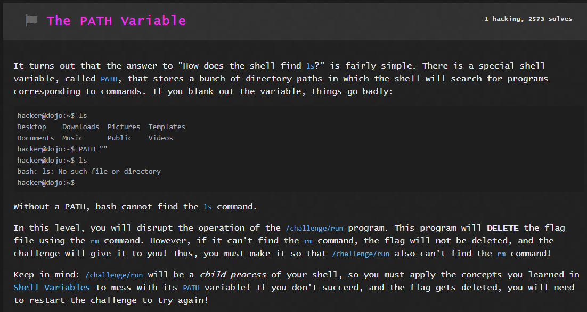
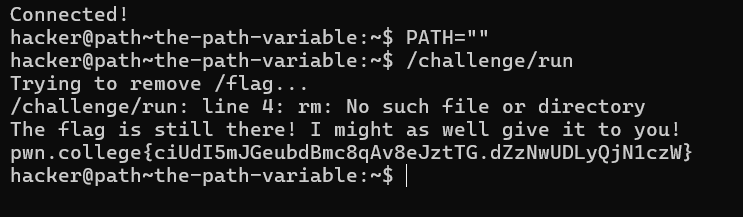
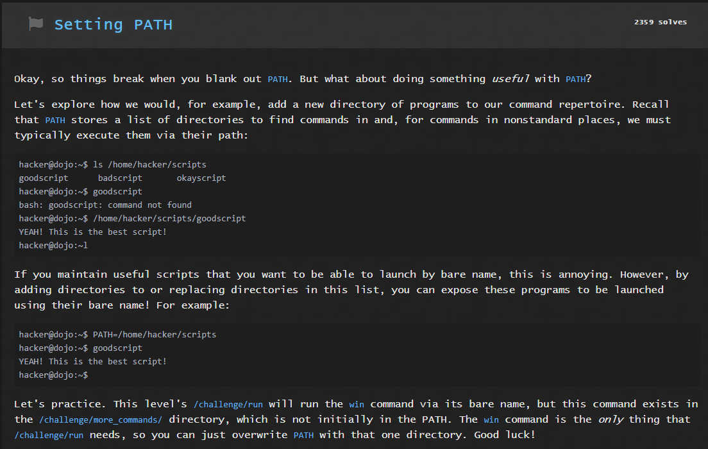
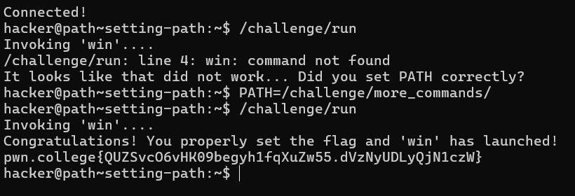
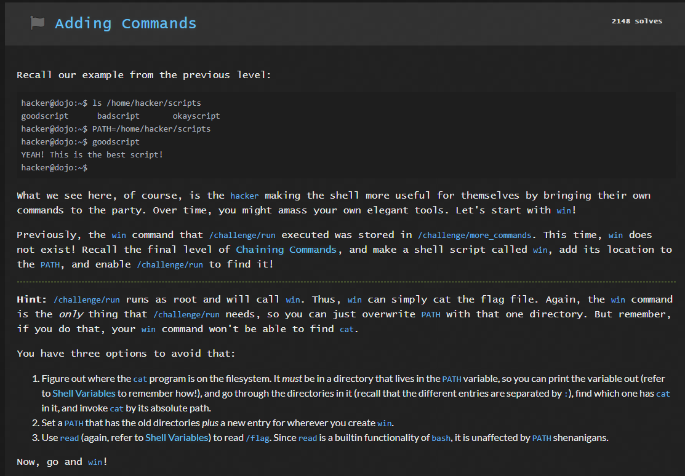
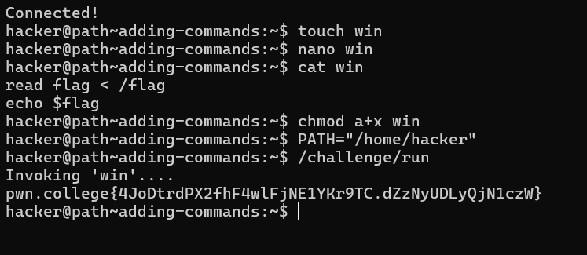
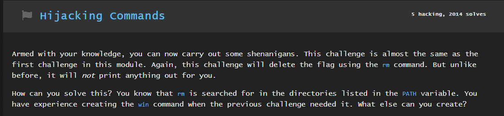
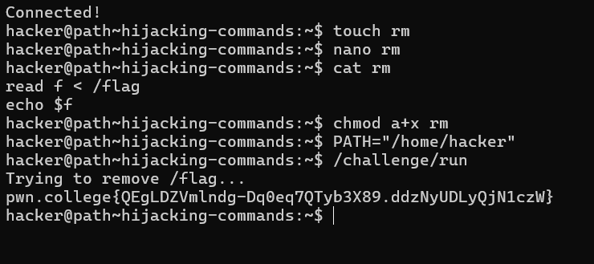

# LINUX LUMINARIUM
## Pondering PATH

### Question 1

Solution:

`PATH=''` removes all cmds and files from the terminal and only `/challenge/run` can be executed. This gets me the flag

### Question 2

Solution:

PATH is set to the given address after which `/challenge/run` is executed after which the flag is displayed.

### Question 3

Solution:

Firstly, win file is created using `touch` .

`nano win` it is cmd which helps in editing the text in the file win. It is not mentioned in any of the modules.

`chmod a+x win` allows all to execute win.

PATH is set to the current workking directory and `/challenge/run ` is executed.This gives us the flag.

### Question 4

Solution:

The solution is similar to the previous problem.
Just like creating file win, I created a file rm here and followed the same steps as the last problem.

