## Pondering Paths
### Question 1
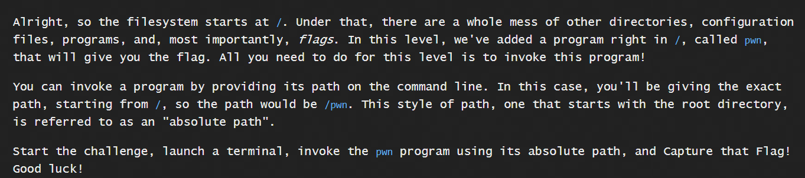
Solution:
### command:
`/pwn`
### Solution:

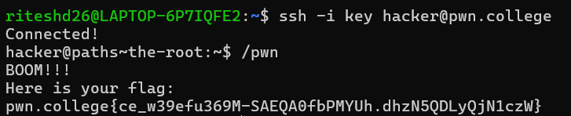

### Question 2
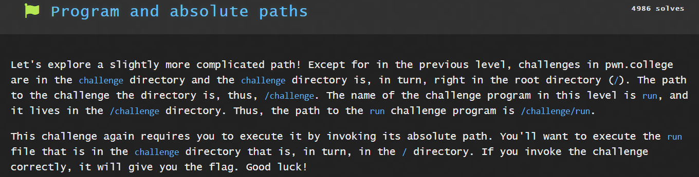
Solution:
### command:
`/challenge/run`

 Solution:

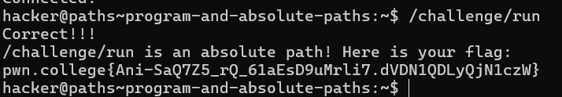

This will get you the flag.

### Question 3
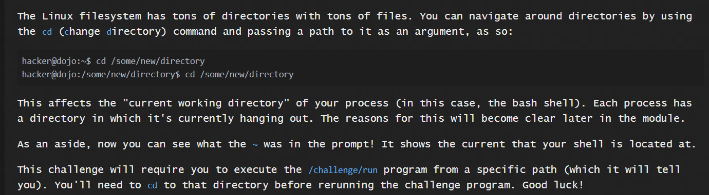
Solution:
I first recieved an error when I ran `/challenge/run`. I was told to cd to /etc.

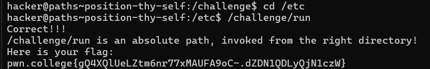

This will get you the flag.

### Question 4
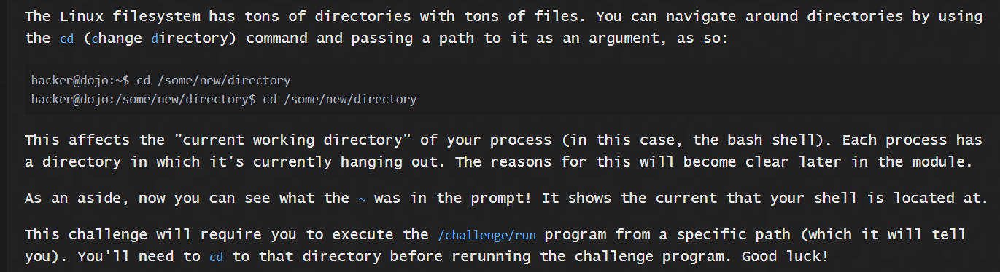
Solution:

Similar to the 3rd problem, I first recieved an error when I ran `/challenge/run`. I was told to cd to /etc.
### command:
`cd /etc`

`/challenge/run`
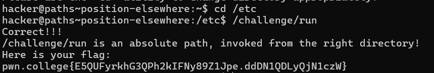

This will get you the flag.
### Question 5
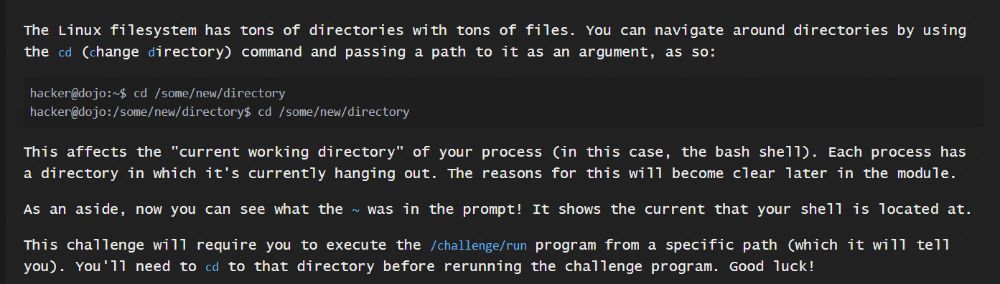

Solution:

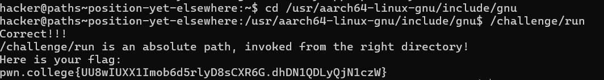

### Question 6
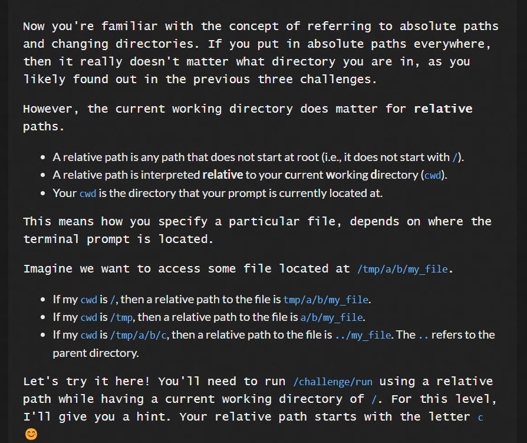

Solution:

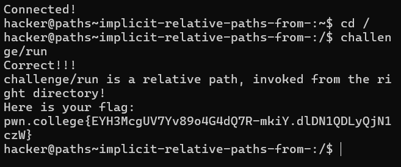

### Question 7
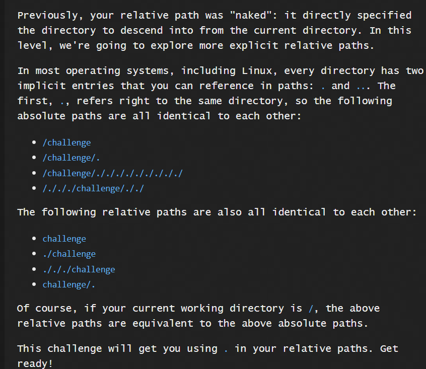

Solution:

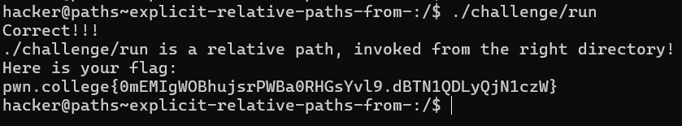

### Question 8
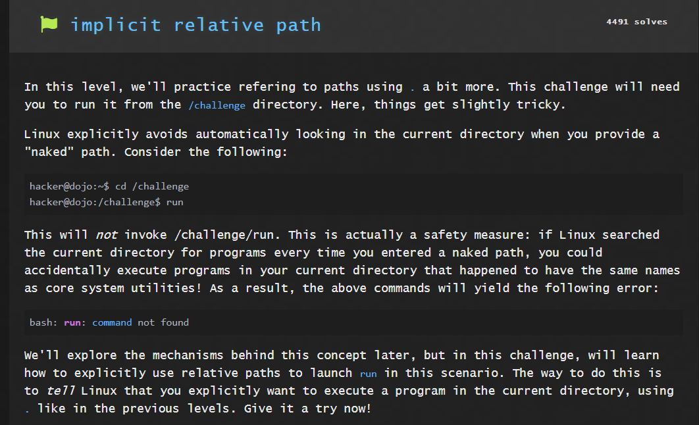

Solution:

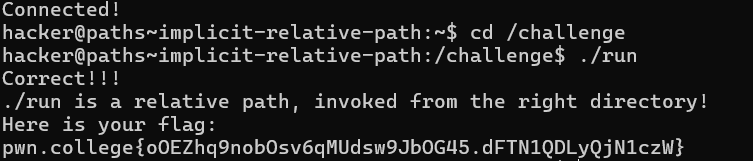

### Question 9
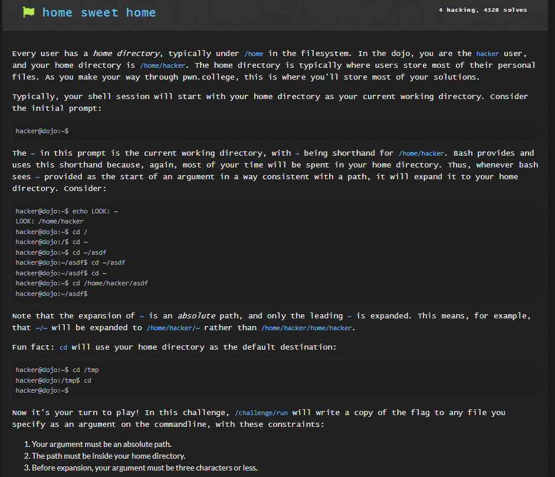

Solution:

The command writes the file content to `/home/hacker/a` which then read to the user.

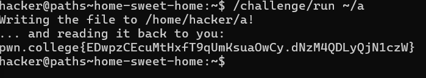

