# LINUX LUMINARIUM
## SHELL VARIABLES

### Question 1

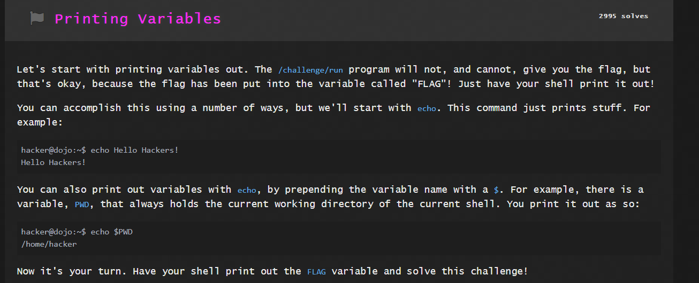

Solution:

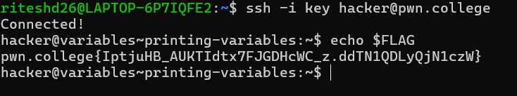

### Question 2

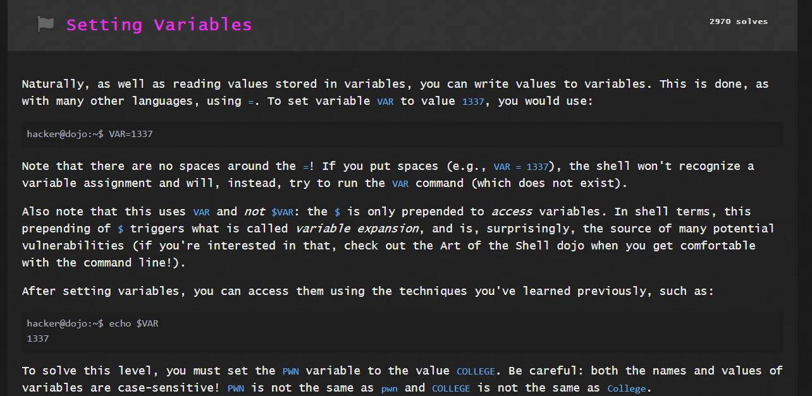

Solution:

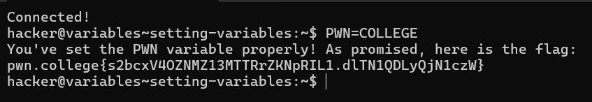

### Question 3

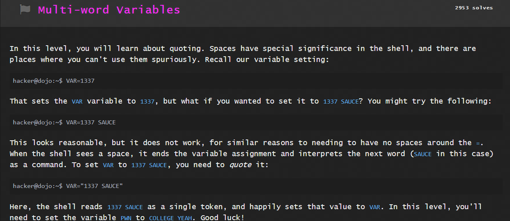

Solution:

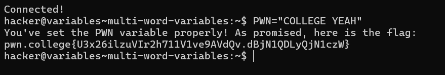

### Question 4

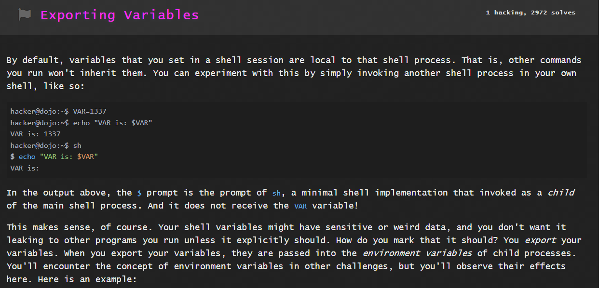
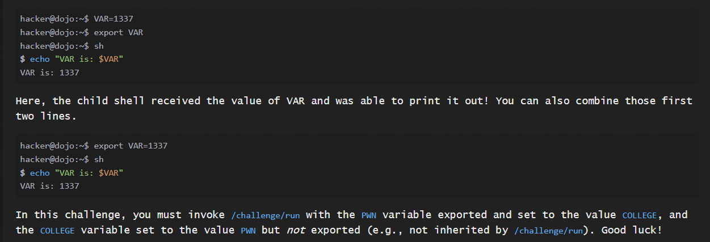

Solution:

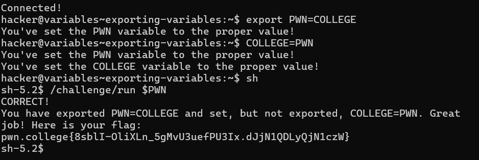

### Question 5

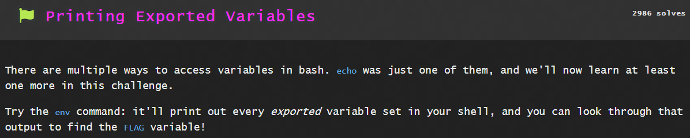

Solution:

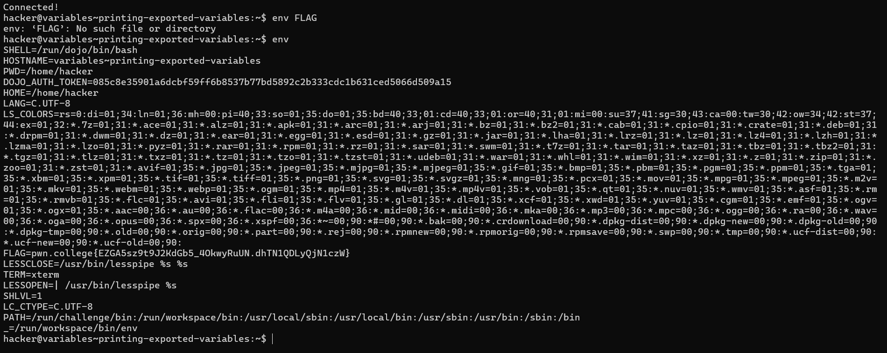

### Question 6

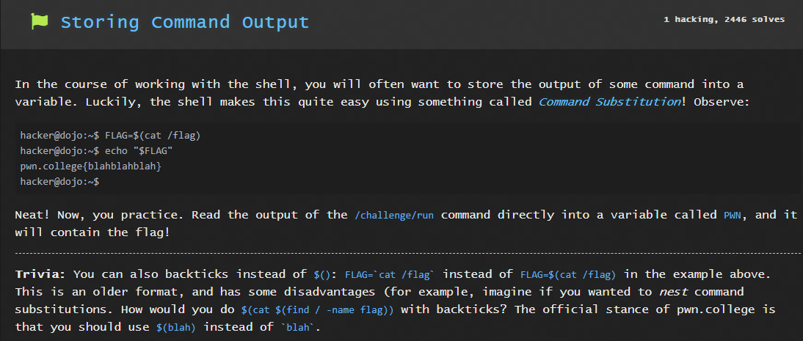

Solution:

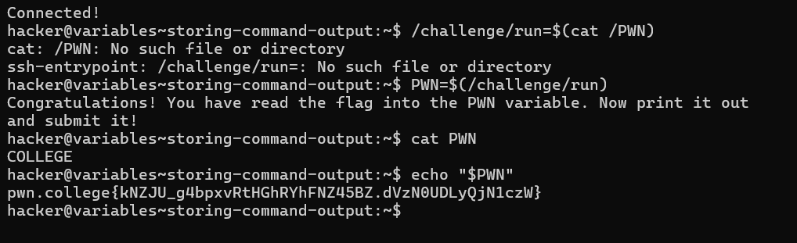

### Question 7

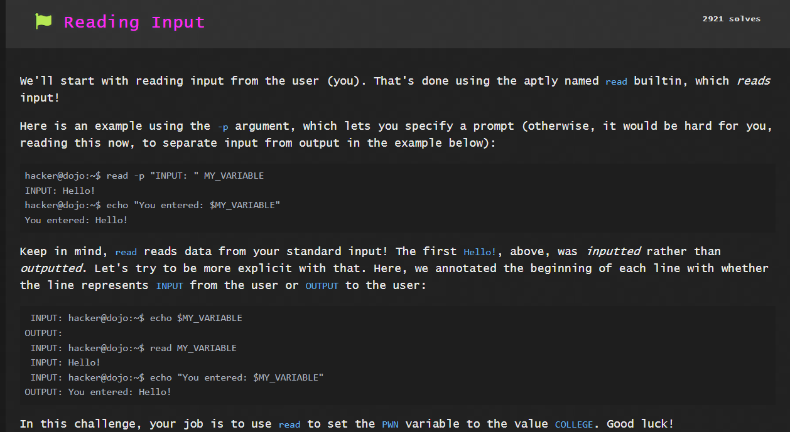

Solution:

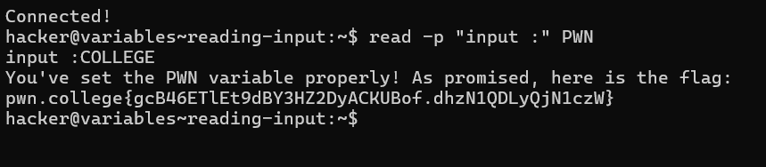

### Question 8

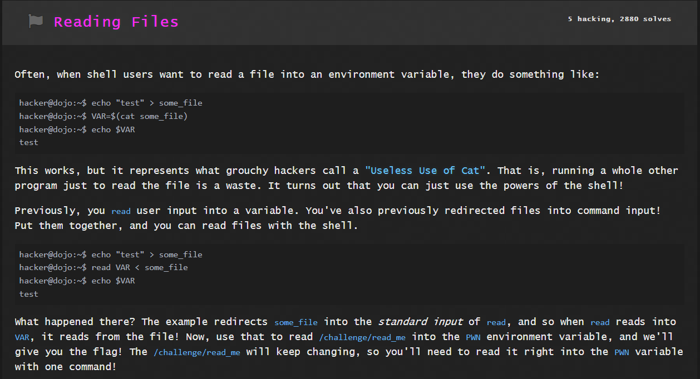

Solution:

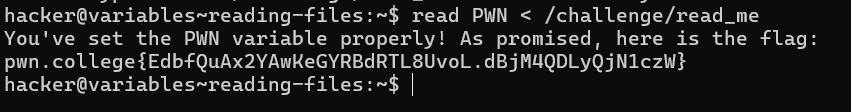